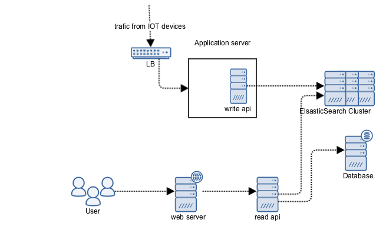

# Business Requirements
A. the full packet captures of device with given ID in a given time interval. You can assume this time interval will not be longer than 1 hour; the users will simply make more requests in case of longer intervals.
B. it is desirable to be able to audit all requests
The data should be made available to the users in an open standard format like pcap and no interpretation is required from the solution.

## Scope
* User authenticated/authorized into system 
* User view data by providing device ID and time
* User can download `pcap` file 
* User queries are stored
* System has `RBAC`
* System records capture traffic and associate packet with user 

## Out of scope
* When sending data from IOT devices it authorizes with certificate which allows to
push metrics and provides info about owner of data
* Configuration
* Backup/restore 
* Metrics
* Health-checks
* Alerts
* HA/Fail-over

## Assumptions
* Traffic evenly distributed as IOT devices mostly "always-on"
* System should support high write throughput

# High level desgin
>you can change the Application code if it is required or helps carrying out the challenge

While I can change application - from description it seems though it is large monolithic application.
Adding additional feature would only bloat it more and make eventual breakup even harder.
That's way all the new services/features will done via micro-service pattern.  

To achieve goal we will need to system:
* `Traffic Storage service` that wil be capable of handling/storing data
* `Writer service` that captures network traffic, converting it into queryable format and push to storage 
* `Web service` that will provide interface for user
* `Reader service` that will query `traffic storage service` and provide data
* `Rational database service(RDS)` to store users, `RBAC` and audit information 

## Traffic Storage service
`Elastic Search(ES)`  cluster which will be used to store converted captured traffic 
## Writer service
Will added into existing VM, captures traffic, converts into `ES` compatible format
## Web service
Provide endpoint trough which end-user can authenticated/authorized into system 
and request `pcap` for their associated devices.
Records all user activities
## Read service
Queries `ES` and converts into `pcap` format which is then server `web service` to end user
### Rational database service
Store date which is related to user and audit

